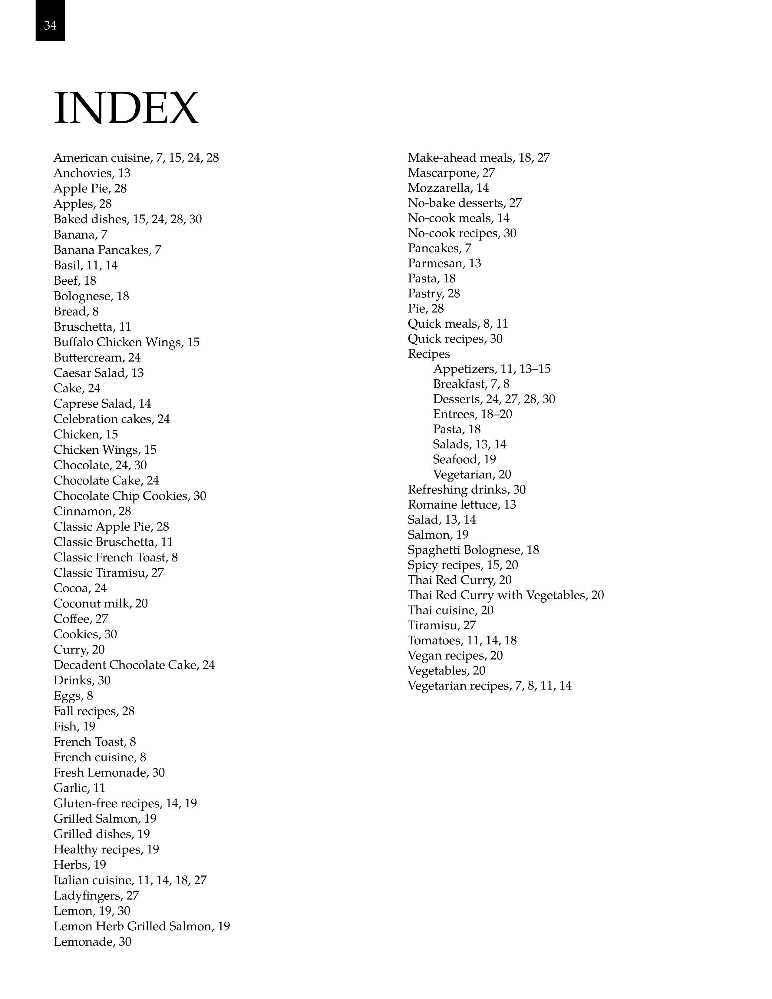
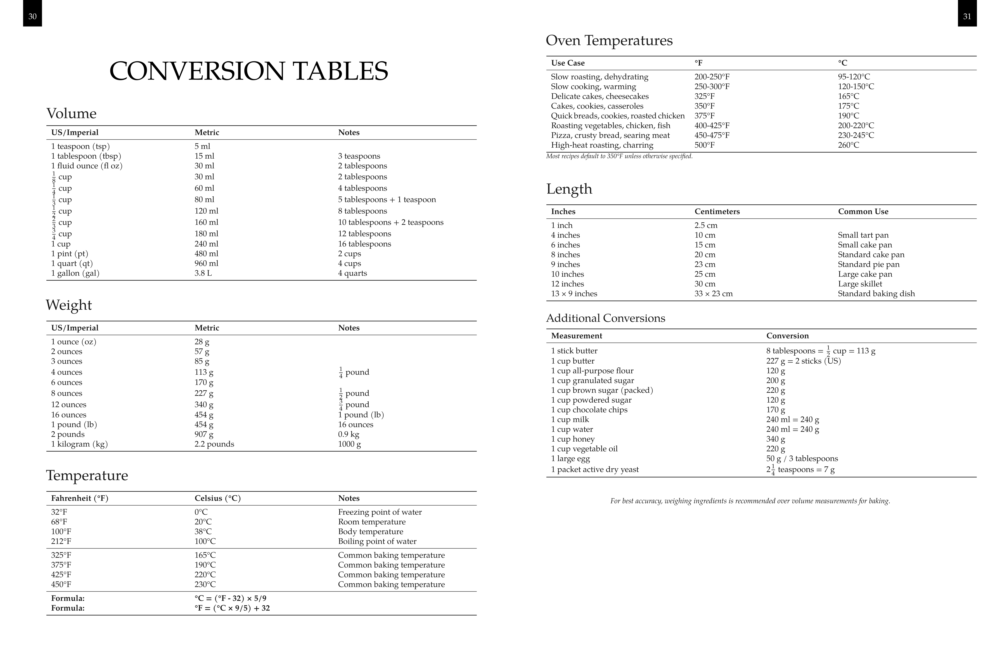
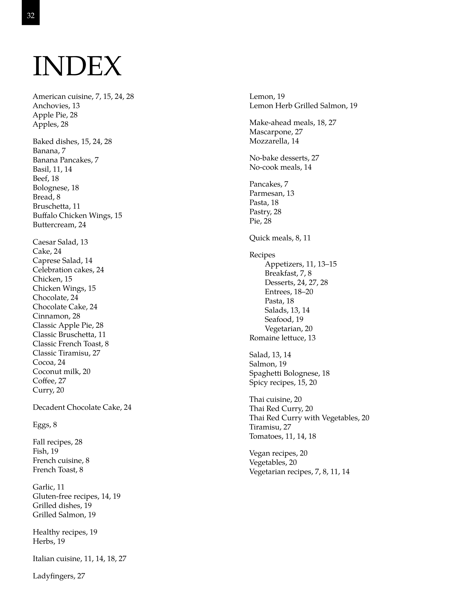

# LaTeX Cookbook Template

> A professional, customizable LaTeX template for creating beautiful cookbooks and recipe collections.

<div align="center">


[Features](#features) • [Quick Start](#quick-start) • [Documentation](DOCUMENTATION.md) • [Examples](#examples)

</div>

## ✨ Features

- 📖 **Full Book Structure** - Cover, preface, chapters, table of contents, index, and back cover
- 🌍 **Multi-Language Support** - Built-in English and French translations via babel
- 🎨 **Flexible Layouts** - Multiple recipe layouts (columns, simple) and customizable spacing
- 🖼️ **Rich Media** - Full-page images, recipe photos, and chapter dividers
- 🏷️ **Smart Organization** - Automatic recipe indexing, tagging system with emoji icons
- 📝 **Recipe Notes** - Add contextual notes to ingredients and instructions with automatic numbering
- 📏 **Conversion Tables** - Built-in measurement conversion pages
- 🖨️ **Print Production** - Bleed margins and gutter settings for book printing
- ⚙️ **Highly Customizable** - Control colors, fonts, spacing, margins, and more
- 🔧 **Easy Compilation** - Included build script for hassle-free PDF generation

## 🚀 Quick Start

### Requirements

- LaTeX distribution (TeX Live, MiKTeX, etc.)
- LuaLaTeX engine
- The `babel` package (included in most distributions)

### Installation

1. Clone this repository:

```bash
git clone https://github.com/AshDevFr/latex-cookbook-template.git
cd latex-cookbook-template
```

2. Compile your cookbook:

```bash
./build.sh
```

Your PDF will be generated in the `dist/` directory.

### Docker Build (Alternative)

If you prefer to build in a controlled environment using Docker:

1. Build and run with Docker Compose:

```bash
docker compose run --rm build
```

2. For more build options (verbose mode, force clean build):

```bash
docker compose run --rm build ./build.sh -v    # Verbose mode
docker compose run --rm build ./build.sh -f    # Force clean build
docker compose run --rm build ./build.sh -v -f  # Both options
```

The Docker setup uses the same dependencies as the CI environment, ensuring consistent builds across different systems.

### Basic Usage

```latex
\documentclass[letterpaper, 10pt, twoside, english]{CookBook}

\begin{document}

% Cover page
\makecoverpage{
    title={My Cookbook},
    subtitle={Family Recipes},
    author={Your Name},
    image={images/book/cover.jpg}
}

% Table of contents
\maketoc

% Chapter
\makechapterpage{
    title={Breakfast},
    image={images/book/breakfast.jpg}
}

% Recipe
\recipe{
    title={Banana Pancakes},
    serves={4},
    preptime={10 mins},
    cookingtime={15 mins},
    tags={Breakfast, Sweet, Vegetarian},
    vegetarian={yes},
    ingredients={
        \ingredient{2 ripe bananas, mashed}
        \ingredient{2 eggs}
        \ingredient{1/2 cup flour}
    },
    instructions={
        \instruction{Mix all ingredients together.}
        \instruction{Cook on a hot griddle until golden.}
        \instruction{Serve with maple syrup.}
    }
}

\end{document}
```

## 📚 Documentation

For comprehensive documentation including all commands, options, and advanced features, see [DOCUMENTATION.md](DOCUMENTATION.md).

For a list of changes and version history, see [CHANGELOG.md](CHANGELOG.md).

**Quick Links:**

- [Document Class Options](DOCUMENTATION.md#document-class-options)
- [Recipe Commands](DOCUMENTATION.md#recipe-command)
- [Layout Options](DOCUMENTATION.md#layout-options)
- [Language Support](DOCUMENTATION.md#language-support)
- [Customization Guide](DOCUMENTATION.md#customization)
- [Complete Examples](DOCUMENTATION.md#complete-examples)

## 🖼️ Examples

<table>
  <tr>
    <td></td>
    <td></td>
  </tr>
  <tr>
    <td></td>
    <td></td>
  </tr>
</table>

<details>
<summary>View More Examples</summary>

### Cover and Back Cover

<table>
  <tr>
    <td></td>
    <td></td>
  </tr>
</table>

### Conversion Table and Index

The template supports conversion tables and index pages.

<table>
  <tr>
    <td></td>
    <td></td>
  </tr>
</table>

### English Examples

<table>
  <tr>
    <td></td>
    <td></td>
  </tr>
  <tr>
    <td></td>
    <td></td>
  </tr>
</table>

### French Examples

The template supports French language.

<table>
  <tr>
    <td></td>
    <td></td>
  </tr>
</table>

### Print Version

The template supports print production with bleed margins.

<table>
  <tr>
    <td></td>
    <td></td>
  </tr>
</table>

</details>

## 🗂️ Project Structure

```
latex-cookbook-template/
├── cookbook.cls              # Main LaTeX class file
├── build.sh                  # Build script for compilation
├── Dockerfile                # Docker configuration for controlled builds
├── docker-compose.yml        # Docker Compose configuration
├── README.md                 # This file
├── DOCUMENTATION.md          # Comprehensive documentation
├── samples/                  # Example cookbook files
│   ├── cookbook-sample.tex
│   └── cookbook-sample-fr.tex
├── images/
│   ├── book/                # Cover and chapter images
│   └── recipes/             # Recipe photos
├── dist/                    # Generated PDFs (created by build script)
└── tmp/                     # Temporary build files
```

## 🤝 Contributing

Contributions are welcome! Whether it's bug reports, feature requests, or code contributions:

1. Fork the repository
2. Create your feature branch (`git checkout -b feature/AmazingFeature`)
3. Commit your changes (`git commit -m 'Add some AmazingFeature'`)
4. Push to the branch (`git push origin feature/AmazingFeature`)
5. Open a Pull Request

## 📄 License

This template is licensed under CC BY-NC-SA 4.0 - see the [Creative Commons website](https://creativecommons.org/licenses/by-nc-sa/4.0/) for details.

**Attribution:** You are free to use this template for non-commercial purposes. If you share or adapt this template, you must give appropriate credit and license your work under the same terms.

## 🙏 Acknowledgments

This template was conceptually inspired by:

- **[Jacopo Recipe](https://www.latextemplates.com/template/jacopo-recipe)** by Vel - two-column recipe layout concept
- **[Cookbook Layout with Orange Accents](https://stock.adobe.com/templates/cookbook-layout-with-orange-accents/325823688)** (Adobe Stock) - page numbering and chapter layout design

This is an independent implementation with significant extensions including multi-language support, full book structure, recipe indexing, conversion tables, and extensive customization options.

## 👤 Author

**AshDevFr**

- GitHub: [@AshDevFr](https://github.com/AshDevFr)

## ⭐ Support

If you find this template useful, please consider giving it a star on GitHub! It helps others discover the project.

---

<div align="center">
Made with ❤️ for home cooks and cookbook creators
</div>
